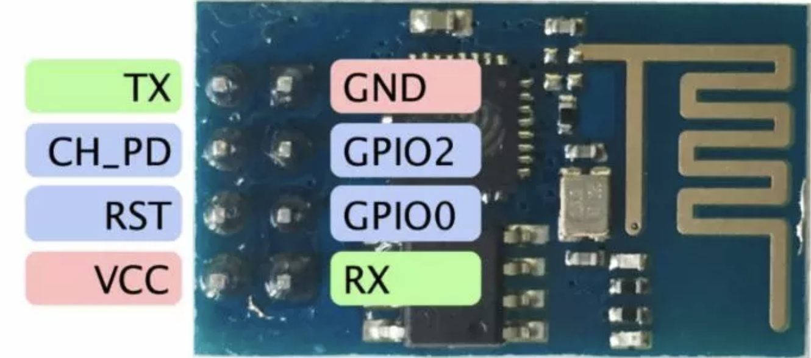
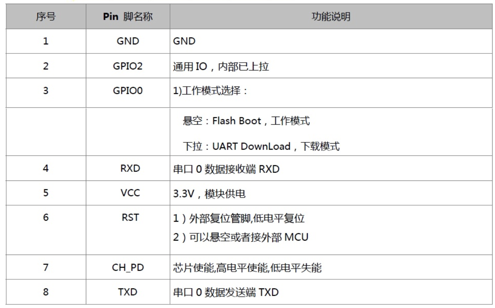
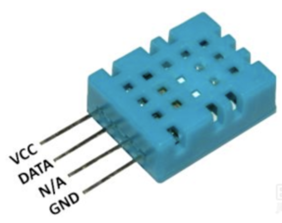
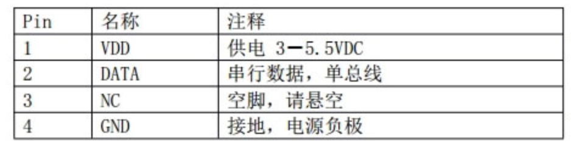
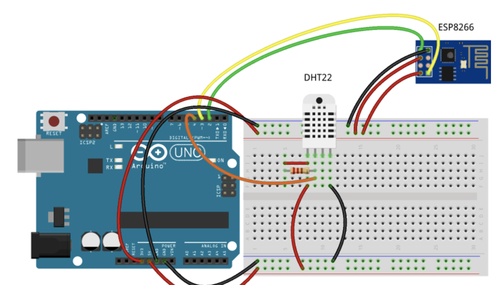
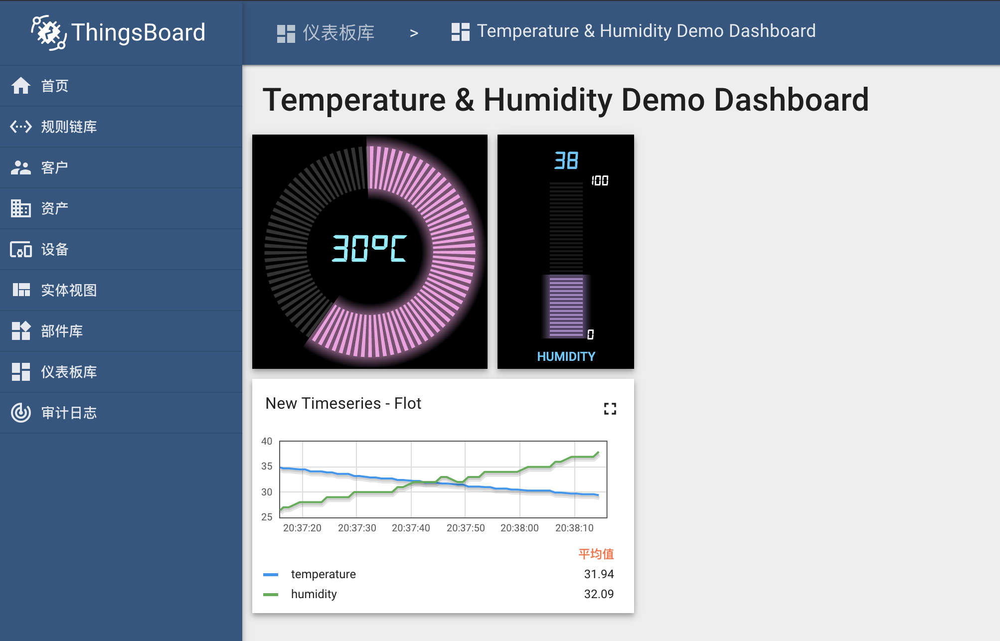
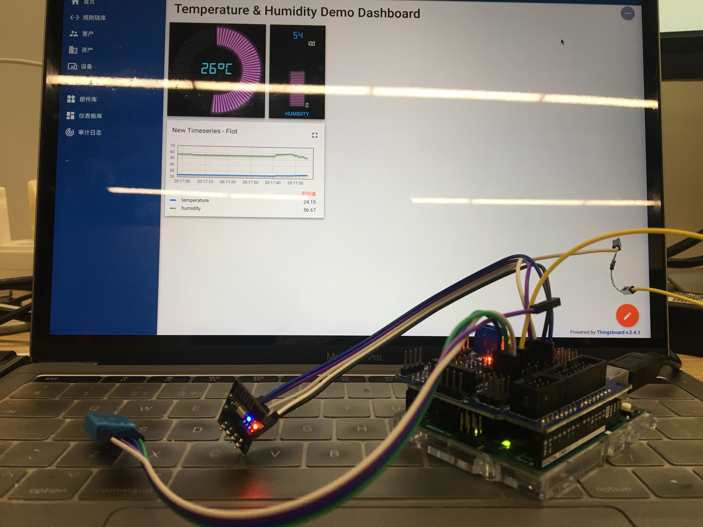

# arduino+esp8266+dht11+thingsboard 展示温湿度demo

## [参考](https://create.arduino.cc/projecthub/thingsboard/temperature-dashboard-using-arduino-uno-esp8266-and-mqtt-5e26eb)

## 依赖库：

- Mqtt库：https://github.com/knolleary/pubsubclient
- Wifiesp: https://github.com/bportaluri/WiFiEsp
- Sensor: https://github.com/adafruit/Adafruit_Sensor
- DHT: https://github.com/adafruit/DHT-sensor-library

## 设备

### arduino uno 20元

### esp8266 es-01 10元

- 示意图：

- 说明表：

### dht11 2元

- 示意图：

- 说明表：

### arduino sensor shield v5.0

这个主要用来扩展arduino uno板子，多了一些G V针脚，方便接入更多的传感器

## 接线方法

- esp8266的rx接arduino的9号针脚，tx接8号针脚。GND接GND，3.3v接3.3v。CHPD口是wifi模块开关，使用的时候需要接VCC，中间需要接一个10k电阻。
- dht11数据针脚接3号针脚。GND接GND，VCC接VCC。
- 图示：这个图是借用别人的，大概接法类似，可以参考。

## Thingsboard展示

## 实物展示

